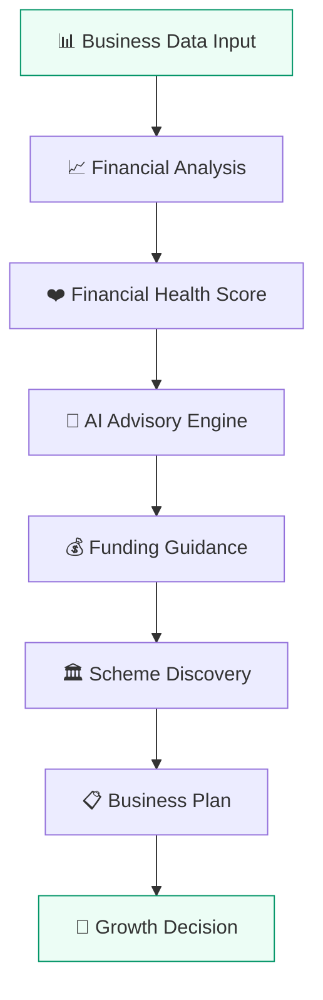
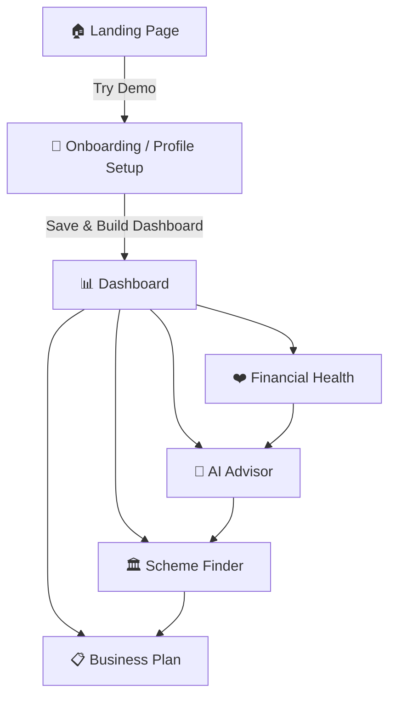
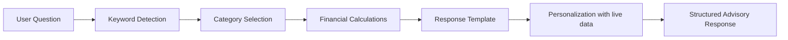
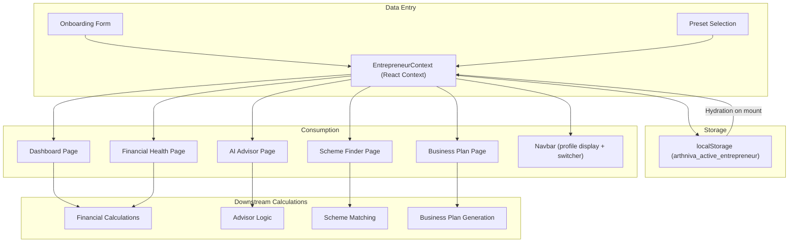
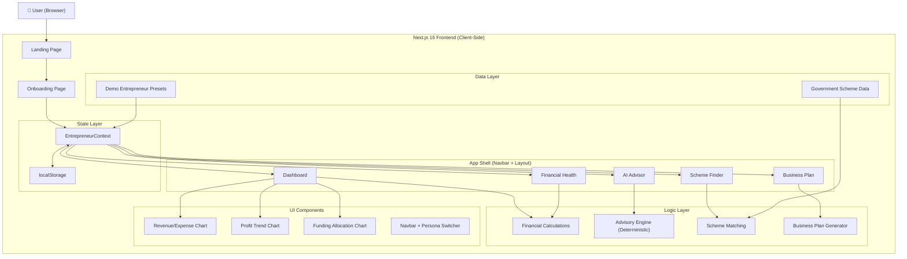
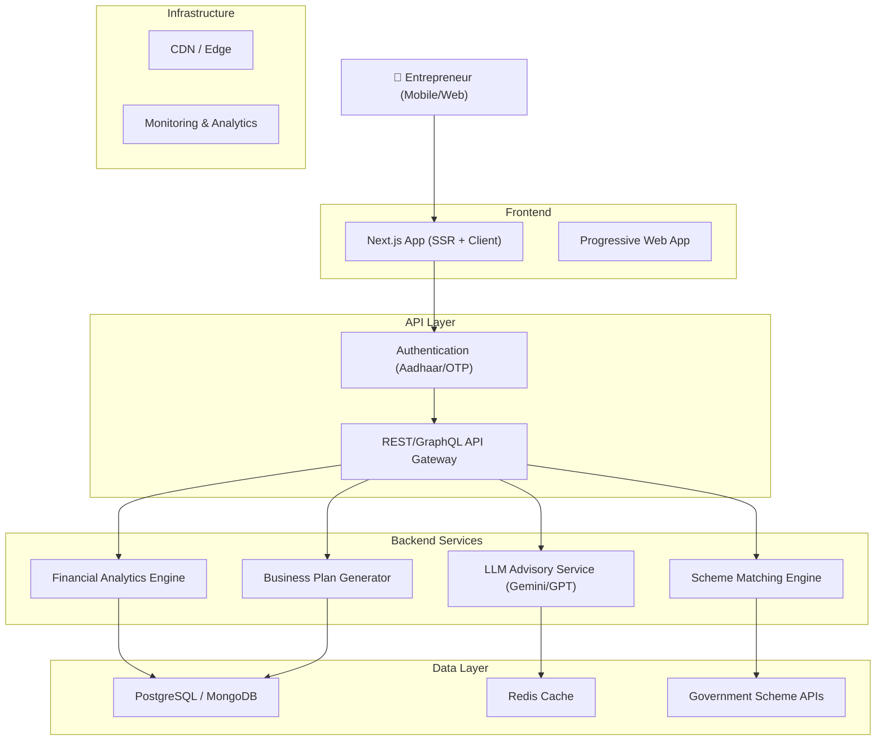

# ARTHNIVA — Complete Project Documentation

## Smart India Hackathon 2026 | PS 26091
### AI-Driven Business Advisory & Financial Structuring Assistant for Rural Micro-Entrepreneurs

---

# A. Executive Project Summary

**Arthniva** is an AI-driven business advisory and financial structuring assistant designed specifically for rural micro-entrepreneurs in India. Built as a responsive web application, Arthniva transforms basic business information — monthly revenue, expenses, existing debt, and funding goals — into a connected decision-support journey that includes financial health assessment, personalized advisory guidance, government scheme discovery, and structured business plan generation. Unlike generic business analytics dashboards that simply visualize numbers, Arthniva interprets those numbers in the context of each entrepreneur's specific situation, translating financial data into plain-language recommendations about loan affordability, risk exposure, funding allocation, and growth planning. The platform is built for users like dairy farmers, handloom weavers, and agri-processors who may lack formal financial literacy but need actionable guidance to make informed borrowing, expansion, and investment decisions. Arthniva directly addresses PS 26091 by providing an end-to-end advisory pipeline: from business data intake → financial analysis → AI-powered guidance → scheme matching → business plan output, making the rural micro-entrepreneur the center of every computation.

> **Status Classification**
>
> | Label | Meaning |
> |-------|---------|
> | 🟢 **IMPLEMENTED** | Fully functional in the current prototype |
> | 🟡 **MOCK / DEMO** | Works but uses illustrative/deterministic data rather than live external sources |
> | 🔵 **FUTURE SCOPE** | Planned but not yet implemented |

---

# B. Problem Statement

## The Problem

Rural micro-entrepreneurs across India — dairy farmers, handloom weavers, food processors, artisans — generate real income and operate viable businesses, but they lack structured financial understanding and advisory support to make critical growth decisions.

## Why It Happens

- **No accessible financial advisory**: Professional financial advisors are concentrated in urban areas and charge fees beyond micro-enterprise budgets.
- **Complex government schemes**: Hundreds of potentially beneficial schemes exist (MUDRA, NABARD, PMFME, SAMARTH), but eligibility criteria are scattered across multiple portals in complex bureaucratic language.
- **Financial illiteracy gap**: Entrepreneurs understand their daily business operations but cannot translate their numbers into formal metrics like profit margins, debt-to-income ratios, or loan serviceability.
- **Unstructured borrowing**: Without understanding repayment pressure, many entrepreneurs take loans that exceed their capacity, leading to debt traps.

## Who Is Affected

- **~63 million MSMEs** in India, with the vast majority being micro-enterprises in rural and semi-urban areas.
- Dairy farmers, livestock owners, handloom weavers, food processors, artisans, and village-level traders.
- Women-led self-help group enterprises.

## The Existing Gap

| What Exists | What's Missing |
|---|---|
| Generic business dashboards | Personalized financial interpretation |
| Government scheme portals | Matching schemes to a specific entrepreneur's profile |
| Bank loan calculators | Contextual affordability guidance considering existing debt + expansion costs |
| Business plan templates | Auto-generated plans personalized to the entrepreneur's financials |

## How Arthniva Addresses the Gap

Arthniva bridges this gap by creating a **connected advisory pipeline**:

```
Business Data → Financial Health Score → AI-Guided Advisory →
Scheme Discovery → Business Plan → Growth Decision
```

Every output is personalized to the specific entrepreneur. Instead of raw numbers, the entrepreneur receives guidance like: *"Your ₹15,000 monthly profit can service approximately ₹9,900/month in EMI, consuming 66% of your surplus — proceed with caution."*

---

# C. Target Users

## Primary Users

**Rural micro-entrepreneurs** operating small businesses in villages, small towns, and semi-urban areas across India.

### Typical User Characteristics

| Characteristic | Description |
|---|---|
| Business size | Monthly revenue ₹15,000 – ₹1,00,000 |
| Sectors | Dairy, handloom, agri-processing, artisan crafts, small retail |
| Location | Villages and small towns (e.g., Vidisha, Chanderi, Hoshangabad in MP) |
| Financial literacy | Understands daily operations but not formal financial metrics |
| Technical literacy | Can use a smartphone; familiar with WhatsApp and basic apps |
| Advisory access | Little to no access to professional financial advisors |
| Funding need | ₹50,000 – ₹5,00,000 for expansion, equipment, or working capital |

### Financial/Business Challenges

- Cannot calculate whether a loan EMI is affordable against current income
- Unaware of which government schemes they might be eligible for
- No structured business plan to present to banks or financial institutions
- Risk of over-borrowing or under-investing due to lack of structured guidance

## Secondary Potential Users

- **Rural bank branch managers** — to quickly assess micro-enterprise viability
- **SHG (Self-Help Group) coordinators** — to help group members plan funding
- **Government scheme counselors** — to match entrepreneurs with relevant programs
- **NGO field workers** — to provide financial literacy support

## Why the UI Is Intentionally Simple

The interface uses:
- Large, readable text with clear labels
- Color-coded indicators (green = positive, amber = caution, red = warning)
- Pre-filled demo personas so users can explore immediately
- Simple language rather than financial jargon
- Step-by-step navigation rather than complex multi-panel layouts

---

# D. Solution Overview

Arthniva is a **client-side Next.js web application** that takes basic business and financial information from rural micro-entrepreneurs and processes it through four interconnected advisory modules:

### The Four Pillars

| Pillar | What It Does | Status |
|---|---|---|
| **Financial Health Assessment** | Calculates a 0–100 health score from revenue, expenses, debt, and funding feasibility | 🟢 IMPLEMENTED (rule-based) |
| **AI Business Advisor** | Answers financial questions with structured, personalized guidance | 🟡 MOCK/DEMO (deterministic keyword-matched engine, not real AI/LLM) |
| **Government Scheme Finder** | Matches potentially relevant schemes to the entrepreneur's profile | 🟡 MOCK/DEMO (illustrative scheme data, not connected to live government APIs) |
| **Business Plan Generator** | Produces a structured 10-section expansion blueprint | 🟢 IMPLEMENTED (deterministic template engine personalized with real financial data) |

### Key Differentiator

Arthniva is **not a dashboard**. It is a **decision-support system**. Every chart, every number, every page is framed around a decision question:
- "Is my business generating enough surplus to service a new loan?"
- "What risks should I consider before expanding?"
- "Which government schemes might support my specific business type?"

---

# E. How Arthniva Works

## Conceptual Pipeline



### Stage-by-Stage Breakdown

| Stage | What Enters | What Arthniva Does | What Is Produced | How It Helps |
|---|---|---|---|---|
| **1. Business Data** | Name, location, business type, revenue, expenses, existing loan, funding goal, purpose | Stores in React Context + localStorage | Entrepreneur profile accessible to all modules | Establishes the baseline for all downstream calculations |
| **2. Financial Analysis** | Revenue, expenses | Calculates profit, profit margin, expense ratios | Net monthly profit, operating margin % | Entrepreneur sees clear picture of actual earnings |
| **3. Financial Health** | All financial data + funding requirement | Applies 100-point rule-based scoring across 4 dimensions | Health score (0–100), label (Strong/Moderate/Needs Attention/Critical), strengths list, watch-outs list | Transparent assessment of business viability for borrowing |
| **4. AI Advisory** | User's natural-language question + entrepreneur profile | Keyword-matched deterministic engine selects response template, injects personalized financial calculations | Structured advisory response with assessment, financial snapshot, risks, recommendations, next steps | Answers specific questions like "Can I afford a ₹3L loan?" with personalized numbers |
| **5. Funding Guidance** | Funding amount, existing debt, monthly profit | Calculates estimated EMI (~3.3% monthly factor), post-EMI surplus, EMI-to-profit ratio, total post-funding debt | Clear picture of loan affordability and repayment pressure | Entrepreneur understands the real cost of borrowing |
| **6. Scheme Discovery** | Business category, location, funding amount, entrepreneur name | Scores 7 illustrative government schemes by category match, funding range match, and profile signals | Ranked scheme list with personalized relevance explanations | Entrepreneur discovers schemes they may not have known about |
| **7. Business Plan** | All entrepreneur data | Generates 10-section expansion blueprint with revenue projections, cost management, risk analysis, phased roadmap | Print-ready business plan document | Entrepreneur has a structured document to present to banks |

---

# F. Complete User Journey

### 🟢 All steps below are IMPLEMENTED in the current prototype



### Step-by-Step Walkthrough

**Step 1: Landing Page** (`/`)
- Clean, professional landing page with Arthniva branding
- Displays the SIH 2026 PS 26091 badge
- Four value propositions: Understand Finances, Explore Funding, Discover Schemes, Build a Plan
- "How Arthniva Works" 5-step visual pipeline
- Target user section: Dairy & Livestock, Agri-Business, Artisan & Crafts
- CTA: "Try Demo" → navigates to `/onboarding`

**Step 2: Onboarding / Profile Setup** (`/onboarding`)
- **Quick-Load Personas**: Three pre-configured rural entrepreneurs (Ramesh, Sunita, Rajesh) — one click to load
- **Editable Form**: 4 sections:
  1. Entrepreneur Details (name, location)
  2. Business Profile (business name, category dropdown)
  3. Financial Baseline (monthly revenue, expenses, existing loan)
  4. Target Funding Requirement (amount, purpose)
- "Save & Build My Dashboard" → stores data in Context + localStorage → navigates to `/dashboard`

**Step 3: Dashboard** (`/dashboard`)
- Personalized greeting: "Good morning, Ramesh 👋"
- Business context badges (category, location)
- Demo persona switcher (Ramesh / Sunita / Rajesh)
- **AI Executive Advisory Synthesis**: 3-panel dark card showing:
  - Operating Surplus assessment
  - Funding & Debt Exposure (estimated EMI, % of surplus)
  - Recommended Next Step
- **6 Financial Summary Cards**: Revenue, Expenses, Profit, Margin, Existing Debt, Funding Goal
- **Financial Health Score**: SVG ring chart (0–100) with label
- **Revenue vs Expenses Chart**: 6-month bar chart (Recharts) with advisory takeaway
- **Profit Trend Chart**: 6-month area chart with growth annotation
- **Funding Allocation Chart**: Donut chart showing proposed use of funds
- **Advisory Action Hub**: 3 CTA cards linking to AI Advisor, Schemes, Business Plan

**Step 4: Financial Health** (`/financial-health`)
- Large score ring with detailed diagnostic explanation
- Explicit disclaimer: "Prototype Advisory Estimate — Not a Credit Score"
- 6 financial metric cards with contextual descriptions
- **Strengths** panel: Dynamically generated positive indicators
- **Watch-outs** panel: Dynamically generated risk warnings
- CTA: "Ask AI Advisor" for loan affordability

**Step 5: AI Advisor** (`/advisor`)
- Text input for custom questions
- 8 personalized suggested questions (e.g., "Can I afford a ₹3,00,000 loan for business expansion?")
- "Thinking" animation while processing
- **Structured response** with:
  - Assessment badge (Positive / Cautious / Warning)
  - Assessment text
  - Financial Breakdown strip (6 mini-cards)
  - "Why This Matters" section
  - "Key Risks" section
  - "Recommended Next Steps"
  - Disclaimer: "Deterministic Financial Risk Analysis"
- Follow-up question suggestions

**Step 6: Scheme Finder** (`/schemes`)
- Header with illustrative data disclaimer
- Search bar + category filter pills (All, Top Matches, Dairy, Textile, Agri, MSME, Women, Rural)
- 7 government scheme cards, each with:
  - "Top Recommendation" badge for high-match schemes
  - Ministry name, scheme name, purpose
  - **Personalized relevance** explanation
  - Funding type and subsidy percentage badges
  - Expandable eligibility hints + benefits
  - Verification notice

**Step 7: Business Plan** (`/business-plan`)
- Business snapshot card (name, location, revenue, profit, funding goal)
- "Generate Business Plan" CTA with generating animation
- **10-section structured plan** with:
  1. Business Overview & Executive Summary
  2. Current Financial Baseline & Track Record
  3. Expansion Objective & Capacity Scalability
  4. Capital Investment Requirement
  5. Proposed Use of Funds & Asset Allocation
  6. Revenue Expansion Strategy & Projections
  7. Expense Structure & Cost Management
  8. Risk Analysis & Mitigation Framework
  9. Phased Implementation & Growth Roadmap
  10. Recommended Funding & Scheme Pathway
- Print/PDF button
- Regenerate button
- Advisory disclaimer

---

# G. Demo Persona

## Primary Demo: Ramesh Kumar 🟢 IMPLEMENTED

| Field | Value |
|---|---|
| **Name** | Ramesh Kumar |
| **Location** | Vidisha, District Vidisha, Madhya Pradesh |
| **Business Name** | Shree Dairy Farm |
| **Category** | Dairy |
| **Type** | Dairy Farming & Milk Production |
| **Monthly Revenue** | ₹45,000 |
| **Monthly Expenses** | ₹30,000 |
| **Monthly Profit** | ₹15,000 |
| **Profit Margin** | 33.3% |
| **Existing Loan** | ₹50,000 |
| **Funding Required** | ₹3,00,000 |
| **Funding Purpose** | Business Expansion (Cattle & Shed) |

### Additional Demo Personas 🟢 IMPLEMENTED

| Persona | Business | Category | Revenue | Funding |
|---|---|---|---|---|
| **Sunita Devi** | Chanderi Weaves & Sarees (Chanderi, Ashoknagar, MP) | Handloom & Textiles | ₹28,000/mo | ₹1,50,000 |
| **Rajesh Verma** | Narmada Agro Processing (Hoshangabad, Narmadapuram, MP) | Agri-Processing | ₹75,000/mo | ₹5,00,000 |

### Why These Personas Are Useful

- **Ramesh** (Dairy): Moderate income, existing debt, requesting 20× monthly profit in funding — demonstrates the "proceed with caution" advisory scenario
- **Sunita** (Handloom): No existing debt, smaller funding need — demonstrates a cleaner borrowing profile
- **Rajesh** (Agri-Processing): Higher revenue but larger funding ask — demonstrates scale-appropriate advisory

Switching between personas instantly updates all downstream outputs (dashboard, health score, advisor responses, scheme matches, business plan), demonstrating Arthniva's personalization engine.

---

# H. Financial Intelligence

## Implemented Calculations 🟢

### 1. Monthly Profit
- **Input**: monthlyRevenue, monthlyExpenses
- **Formula**: `profit = revenue - expenses`
- **Output**: Net monthly operating surplus in ₹
- **Purpose**: Core metric for all downstream advisory

### 2. Profit Margin
- **Input**: monthlyRevenue, monthlyExpenses
- **Formula**: `margin = ((revenue - expenses) / revenue) × 100` (rounded to 1 decimal)
- **Output**: Operating margin percentage
- **Purpose**: Indicates business efficiency; used in health score and advisory

### 3. Financial Health Score (0–100) 🟡 RULE-BASED PROTOTYPE

The health score is a **transparent, rule-based composite score** — not a credit score or AI prediction. It evaluates four dimensions:

| Dimension | Max Points | Factors Considered |
|---|---|---|
| **Profitability** | 25 | Positive profit (+12), margin thresholds (+3/5/8), profit amount (+5) |
| **Revenue Stability** | 20 | Revenue tier thresholds (₹15k→7, ₹30k→12, ₹50k→16, ₹100k→20) |
| **Existing Debt Burden** | 20 | Debt-to-annual-revenue ratio, debt relative to profit multiples |
| **Funding Feasibility** | 35 | Funding-to-annual-profit ratio, annual profit vs funding amount |

**For Ramesh Kumar**: Score = 72/100 ("Moderate" health)
- Profitability: ~25/25 (profit > 0, margin 33.3% > 30%, profit > ₹5k)
- Revenue: 12/20 (₹45k > ₹30k threshold)
- Debt: ~20/20 (₹50k loan < 15% of annual revenue, < 6× monthly profit)
- Funding: ~15/35 (₹3L funding is 1.67× annual profit)

### 4. Health Label
- **≥ 80**: "Strong" (emerald)
- **≥ 60**: "Moderate" (amber)
- **≥ 40**: "Needs Attention" (orange)
- **< 40**: "Critical" (red)

### 5. Strengths (Dynamic) 🟢
Generated from financial data:
- Positive monthly profit
- Healthy operating margin (>25%)
- Revenue base above ₹30,000
- Manageable existing loan relative to income

### 6. Watch-outs (Dynamic) 🟢
Generated from financial data:
- Funding exceeds annual profit
- Existing loan considerations
- High borrowing-to-revenue ratio
- Expansion must generate additional income

### 7. Estimated EMI 🟢
- **Formula**: `estimatedEMI = amountRequired × 0.033` (~11.5% annual interest over 36 months)
- **Purpose**: Quick indicative repayment burden for advisory context
- **Not**: A bank-verified EMI calculation

### 8. Monthly Trend Data 🟡 MOCK/DEMO
- Generated dynamically by applying multiplier factors (0.86×–1.0×) to current revenue/expenses
- Creates an illustrative 6-month trend showing growth trajectory
- **Not real historical data** — simulated from current numbers

### 9. Funding Allocation Data 🟡 MOCK/DEMO
- Category-specific allocation templates (Dairy, Handloom, Agri-Processing, Default)
- Calculates ₹ amounts from percentage splits applied to funding requirement
- Example for Dairy: 40% Cattle, 25% Infrastructure, 15% Equipment, 12% Feed, 8% Working Capital

### 10. Expense Breakdown Data 🟡 MOCK/DEMO
- Category-specific expense splits applied to monthly expenses
- Example for Dairy: 40% Feed & Fodder, 27% Labor, 12% Transport, 10% Veterinary, 7% Utilities, 4% Other

### How Financial Analysis Becomes Advisory

The key design principle: **every number is accompanied by an interpretation**.

Instead of showing "Profit: ₹15,000", Arthniva shows:
> "Your business generates **₹15,000/month** in net profit (33.3% margin). This establishes a stable baseline for servicing structured borrowing."

Instead of showing "EMI: ₹9,900", it shows:
> "A ₹3,00,000 loan adds **~₹9,900/mo** in EMI (**~66% of surplus**). Total liability will reach ₹3,50,000."

---

# I. AI Advisor

## Architecture Classification: 🟡 DETERMINISTIC / MOCK AI

### What It Actually Is

The AI Advisor is a **rule-based, keyword-matched deterministic response engine**. It is **not** powered by a real AI model, LLM, or external API. The term "AI" in the prototype refers to the system's ability to dynamically generate personalized, structured financial guidance based on the entrepreneur's specific data.

### How It Works



1. **User submits a question** (text input or clicks a suggested question)
2. **Keyword detection**: The question is normalized to lowercase and checked against keyword groups:
   - `loan, afford, borrow, debt, lakh` → Loan Affordability category
   - `profit, margin, improve, earn more, income` → Profit Improvement category
   - `expand, growth, ready, scale` → Expansion Readiness category
   - `risk, danger, threat, worst` → Financial Risks category
   - `allocate, use, spend, where` → Funding Allocation category
   - No match → Default contextual advice
3. **Financial calculations** are performed in real-time from the entrepreneur's current data:
   - Profit, margin, health score
   - Estimated EMI (amountRequired × 0.033)
   - Post-EMI surplus
   - EMI share of profit
   - Total post-funding debt
   - Funding-to-annual-profit ratio
4. **Response template** is selected based on the question category AND financial thresholds:
   - For loan questions: if `profitAfterEmi < 0` → "Warning" response; if `emiShareOfProfit > 50` → "Cautious" response; else → "Positive" response
5. **Personalization**: All financial values (₹ amounts, percentages, business name, location, category-specific risks) are injected into the response
6. **900ms artificial delay** simulates processing time for better UX

### Response Structure

Every response contains:

| Section | Content |
|---|---|
| `assessment` | Primary advisory conclusion (1–2 sentences with specific ₹ figures) |
| `assessmentType` | `positive` / `cautious` / `warning` — determines visual treatment |
| `financialSnapshot` | 6 mini-cards: Monthly Profit, Margin, Existing Debt, Funding Goal, Estimated EMI, Post-EMI Buffer |
| `whyThisMatters` | 3–4 personalized bullet points explaining the financial context |
| `keyRisks` | 2–3 category-specific operational and financial risks |
| `whatToConsider` | 2–3 actionable recommendations |
| `nextSteps` | 2–3 concrete next actions (often linking to other Arthniva features) |

### Question Topics Covered 🟢

1. **Loan affordability**: "Can I afford a ₹3L loan?" — with 3 response tiers based on post-EMI surplus
2. **Profit improvement**: "How can I improve my margin?" — with category-specific strategies
3. **Expansion readiness**: "Should I expand now?" — with health-score-based assessment
4. **Financial risks**: "What are my biggest risks?" — with category-specific risks (dairy disease, handloom inventory, power outages)
5. **Funding allocation**: "How should I allocate ₹3L?" — with 70-20-10 rule framework

### Suggested Questions (Dynamic) 🟢

8 suggested questions are generated dynamically, incorporating the entrepreneur's specific funding amount, business name, and purpose.

### Category-Specific Personalization 🟢

- **Dairy**: References milk prices, cattle mortality, feed inflation, NABARD schemes
- **Handloom/Textile**: References buyer payments, silk yarn prices, SAMARTH scheme, craft exhibitions
- **Agri-Processing**: References raw material prices, power disruptions, PMFME scheme

### Disclaimer 🟢

The advisor page explicitly states: "Deterministic Financial Risk Analysis" and "This guidance is deterministically generated... It is not loan approval, does not guarantee scheme sanctions, and does not replace formal bank appraisals."

### Future Path Toward Real AI 🔵

To integrate a real LLM/API:
1. Replace `generateAdvisorResponse()` with an API call to a hosted LLM (e.g., Google Gemini, GPT-4)
2. Pass the entrepreneur's financial profile as structured context in the system prompt
3. Use guardrails to ensure the LLM doesn't make claims about loan approval or guaranteed eligibility
4. Add conversation history for multi-turn advisory sessions
5. Fine-tune on rural micro-enterprise financial advisory patterns

---

# J. Funding / Loan Guidance

## How Arthniva Approaches: "Can I afford a ₹3 lakh loan?"

### Factors Considered 🟢

| Factor | Value (Ramesh) | How It's Used |
|---|---|---|
| Monthly Revenue | ₹45,000 | Baseline income |
| Monthly Expenses | ₹30,000 | Operating cost |
| Monthly Profit | ₹15,000 | Available surplus for debt service |
| Existing Loan | ₹50,000 | Pre-existing debt obligation |
| Requested Funding | ₹3,00,000 | New borrowing amount |
| Estimated EMI | ~₹9,900/mo | Indicative monthly repayment (3.3% factor) |
| Post-EMI Surplus | ~₹5,100/mo | Remaining cash after EMI |
| EMI % of Profit | ~66% | Repayment pressure indicator |
| Total Post-Funding Debt | ₹3,50,000 | Combined liability |
| Funding-to-Annual-Profit | 1.67× | Capital recovery ratio |

### Response Logic

```
IF profitAfterEmi < 0 → WARNING: "High Repayment Risk"
ELSE IF emiShareOfProfit > 50% → CAUTIOUS: "Proceed With Caution"
ELSE → POSITIVE: "Manageable Debt Capacity"
```

For Ramesh (EMI ~66% of profit): **"Proceed With Caution"**

### Critical Distinction

| Financial Guidance (Arthniva) | Loan Approval (Bank) |
|---|---|
| Estimates monthly repayment pressure | Formal credit assessment |
| Uses indicative EMI calculation | Uses exact interest rates and tenure |
| Considers self-reported financials | Verifies with bank statements |
| Provides advisory guidance | Issues sanction letters |
| Suggests risk mitigation | Requires collateral/guarantors |

> ⚠️ **Arthniva is NOT a bank, does NOT approve loans, and does NOT guarantee funding.**

---

# K. Government Scheme Finder

## Implementation Status: 🟡 ILLUSTRATIVE DEMO DATA

### Scheme Representation 🟢

7 government schemes are stored as a TypeScript array with the following fields:

| Field | Description |
|---|---|
| `id` | Unique identifier (e.g., "nabard-dairy") |
| `name` | Full scheme name |
| `ministry` | Administering ministry |
| `purpose` | One-line purpose |
| `relevance` | Why it matters for micro-entrepreneurs |
| `fundingType` | Type of financial support |
| `subsidyPercentage` | Subsidy rate if applicable |
| `description` | Detailed description |
| `eligibilityHints` | Indicative eligibility criteria |
| `benefits` | Key program benefits |
| `category` | Classification: dairy / textile / agri / msme / women / rural |

### Schemes Included

1. **NABARD Dairy Entrepreneurship Development Scheme** (dairy) — 25–33.3% capital subsidy
2. **Pradhan Mantri MUDRA Yojana (Kishore)** (msme) — Collateral-free ₹50k–₹5L
3. **PM Formalization of Micro Food Processing Enterprises** (agri) — 35% capital subsidy
4. **SAMARTH — Textile Sector Capacity Building** (textile) — Up to 90% loom subsidy
5. **Kisan Credit Card for Animal Husbandry** (dairy) — ~4% effective interest
6. **Stand-Up India for Women & SC/ST** (women) — ₹10L–₹1Cr composite loans
7. **National Rural Livelihoods Mission (DAY-NRLM)** (rural) — SHG support + 7% interest subvention

### Matching / Relevance Logic 🟢

Each scheme starts with a base match score of 50, then:

| Condition | Score Boost |
|---|---|
| Entrepreneur's category directly matches scheme category (dairy→dairy, handloom→textile, agri→agri) | +45 |
| MUDRA Kishore and funding ≤ ₹5L | +35 |
| Women-focused scheme and entrepreneur name contains "Devi" or "Kumari" | +40 |
| Rural livelihoods scheme (general match) | +25 |

A **personalized relevance explanation** is generated for each scheme, incorporating the entrepreneur's business name, location, and funding amount.

### Why "Potentially Relevant"

The schemes are explicitly labeled as "potentially relevant" because:
- Scheme data is **illustrative** — not pulled from live government databases
- Eligibility is **indicative** — not verified against the user's actual documents
- Application windows and state-specific rules are **not tracked** in real-time

### UI Safeguards 🟢

- Amber disclaimer banner: "Illustrative Scheme Guidance — Not Formal Sanction"
- "Verification Notice" on each scheme's expanded view
- Schemes labeled as "potentially relevant" not "eligible"

### Future: Verified Government Data 🔵

- Connect to official APIs (e.g., MyScheme.gov.in, MUDRA portal, NABARD portal)
- Real-time eligibility verification with KYC data
- Application window tracking
- State-specific scheme variants

---

# L. Business Plan Generator

## Implementation Status: 🟢 IMPLEMENTED (Deterministic Template Engine)

### Inputs Used

| Input | Source |
|---|---|
| Entrepreneur name, location, district, state | Entrepreneur profile |
| Business name, category, type | Business profile |
| Monthly revenue, expenses, existing loan | Financial data |
| Funding amount, purpose | Funding goals |
| Profit, margin (calculated) | Financial calculations |
| Category-specific funding allocations | `getFundingAllocationData()` |

### Generation Logic

The `generateBusinessPlan()` function:
1. Calculates profit, margin, annual figures
2. Retrieves category-specific funding allocation breakdown
3. Computes post-expansion projections:
   - Year 1: Revenue × 1.65, Expenses × 1.45
   - Year 2: Revenue × 2.10, Expenses × 1.70
4. Calculates DSCR (Debt Service Coverage Ratio)
5. Returns an array of 10 `BusinessPlanSection` objects, each with title and content lines

### 10 Sections Generated

| # | Section | Content Type |
|---|---|---|
| 1 | Business Overview & Executive Summary | Enterprise details, funding rationale |
| 2 | Current Financial Baseline & Track Record | Revenue, expenses, profit, margin, DTI ratio |
| 3 | Expansion Objective & Capacity Scalability | Category-specific milestones (cattle/looms/machinery) |
| 4 | Capital Investment Requirement | Total capital, promoter contribution (15%), debt (85%), payback period |
| 5 | Proposed Use of Funds & Asset Allocation | Category-specific allocation breakdown with ₹ amounts |
| 6 | Revenue Expansion Strategy & Projections | Go-to-market strategy, Year 1 & 2 revenue/profit projections |
| 7 | Expense Structure & Cost Management | Post-expansion cost breakdown, EMI allowance, DSCR calculation |
| 8 | Risk Analysis & Mitigation Framework | 4 risk categories with specific mitigations |
| 9 | Phased Implementation & Growth Roadmap | 3-phase timeline (Months 1–2, 3–6, 7–12) |
| 10 | Recommended Funding & Scheme Pathway | Loan structure recommendation, priority scheme matches |

### Personalization Depth

- **Category-specific** content for Dairy, Handloom/Textile, and Agri-Processing
- **₹ amounts** calculated from actual financial data throughout
- **Location names** (Vidisha, Chanderi, Narmadapuram) embedded in strategy sections
- **Projections** derived from actual current revenue/expenses
- **Scheme recommendations** aligned with business category

### Print/PDF Support 🟢
- CSS `@media print` rules hide navigation and buttons
- `window.print()` triggered by Print/PDF button

---

# M. Personalization & Data Flow

## Data Flow Trace



### How Changing the Entrepreneur Changes Everything

When the user switches from Ramesh to Sunita via the persona switcher:

1. `switchEntrepreneur("sunita-handloom")` is called
2. Context updates `entrepreneur` state to Sunita's data
3. `localStorage` is updated with Sunita's data
4. **All consuming components re-render** with Sunita's data:
   - Dashboard: Revenue changes ₹45k → ₹28k, funding changes ₹3L → ₹1.5L
   - Health Score: Recalculated for Sunita's financials
   - Charts: Regenerated from Sunita's revenue/expenses
   - Funding allocation: Changes from Dairy splits to Handloom splits
   - AI Advisor: Resets response, generates new suggested questions for Sunita
   - Schemes: Re-ranked with Handloom/Textile schemes prioritized
   - Business Plan: Resets (requires regeneration with Sunita's data)

### State Management Architecture 🟢

| Concern | Implementation |
|---|---|
| Global state | React Context (`EntrepreneurContext`) |
| Persistence | `localStorage` with key `arthniva_active_entrepreneur` |
| Hydration | `useEffect` on mount loads from localStorage |
| Update methods | `updateEntrepreneur`, `updateFinancials`, `updateFunding`, `updateBusiness`, `updatePersonal` |
| Switching | `switchEntrepreneur(id)` — loads preset by ID |
| Reset | `resetToDefault()` — resets to Ramesh Kumar |
| Loading state | `isLoaded` flag prevents flash of default data |

---

# N. System Architecture

## Current Prototype Architecture 🟢



### Key Architecture Characteristics

| Aspect | Current Implementation |
|---|---|
| **Rendering** | Fully client-side (`"use client"` on all pages) |
| **Backend** | None — all logic runs in the browser |
| **Database** | None — localStorage only |
| **Authentication** | None — demo persona selection |
| **API calls** | None — all data is bundled in the client |
| **AI/ML** | None — deterministic rule-based engine |
| **External APIs** | None — scheme data is hardcoded |

## Future Production Architecture 🔵



### Future Components

| Component | Purpose |
|---|---|
| **Authentication** | Aadhaar-linked OTP or mobile number verification |
| **Persistent Database** | Store entrepreneur profiles, financial history, generated plans |
| **Real LLM Integration** | Google Gemini or similar for natural-language advisory |
| **Government API Connection** | MyScheme.gov.in, MUDRA portal, NABARD APIs for real-time scheme data |
| **Financial History** | Track month-over-month trends with real data |
| **Multi-language Support** | Hindi, Marathi, Tamil, and other regional languages |
| **Offline Support** | PWA with service workers for areas with poor connectivity |

---

# O. Technology Stack

| Technology | Version | Purpose | Why Selected |
|---|---|---|---|
| **Next.js** | 16.3.3 | React framework with App Router, file-based routing, SSR capabilities | Industry-standard for production React apps; fast development with route groups |
| **React** | 19.2.8 | UI component library | Latest stable version with concurrent features |
| **TypeScript** | ^5 | Type-safe JavaScript | Prevents runtime errors; enables better IDE support and refactoring |
| **Tailwind CSS** | ^4 | Utility-first CSS framework | Rapid UI development; consistent design system; responsive-first |
| **Recharts** | ^3.10.1 | React charting library | Declarative chart components (Bar, Area, Pie); good Tailwind integration |
| **Lucide React** | ^1.37.0 | Icon library | Consistent, lightweight SVG icons; tree-shakeable |
| **clsx + tailwind-merge** | ^2.1.1 / ^3.6.0 | CSS class utilities | Conditional class composition without conflicts |
| **class-variance-authority** | ^0.7.1 | Component variant utility | Type-safe component style variants |
| **Inter (Google Font)** | via `next/font` | Typography | Clean, professional, highly readable on screens |

### Not Used (Clarification)

| Technology | Status |
|---|---|
| Backend server | ❌ Not present |
| Database (PostgreSQL, MongoDB) | ❌ Not present |
| External AI/LLM API | ❌ Not present |
| Government API integration | ❌ Not present |
| Authentication library | ❌ Not present |
| State management library (Redux, Zustand) | ❌ Not present — uses React Context |

---

# P. Why Arthniva Is More Than Analytics

| Dimension | Generic Business Dashboard | Arthniva |
|---|---|---|
| **Data Visualization** | Shows charts and numbers | Shows charts with **decision questions** ("Is profit stable enough for EMIs?") |
| **Financial Understanding** | Displays metrics | **Interprets metrics** in context ("Your 33% margin provides adequate debt coverage") |
| **Personalization** | Same view for all users | Every output changes based on the specific entrepreneur's data |
| **Advisory** | None | Structured guidance with assessment, risks, and next steps |
| **Funding Decision Support** | Loan calculator | Full affordability analysis considering existing debt, expansion costs, and repayment pressure |
| **Scheme Discovery** | None | Matched and ranked government schemes with personalized relevance explanations |
| **Business Planning** | Templates | Auto-generated 10-section plan with real financial projections |
| **Growth Recommendations** | None | Category-specific growth strategies (value-added dairy, direct-to-consumer handloom, etc.) |
| **Target User** | Business analysts, managers | **Rural micro-entrepreneurs** with limited financial literacy |
| **Language** | Technical jargon | Simple, clear language with ₹ amounts rather than abstract ratios |

### The Core Difference

> A dashboard says: "Profit Margin: 33.3%"
>
> Arthniva says: "Your dairy farm earns ₹15,000 monthly profit on ₹45,000 revenue (33.3% margin). This is healthy for a rural micro-enterprise. If you take a ₹3 lakh loan, your estimated EMI of ₹9,900/month would consume 66% of this surplus — leaving ₹5,100/month as buffer. Consider applying through NABARD's Dairy Entrepreneurship Scheme for a 25% capital subsidy to reduce your borrowing."

---

# Q. Innovation

### Actual Innovative Aspects 🟢

| Innovation | Why It Matters |
|---|---|
| **Entrepreneur-centric financial interpretation** | Every number is explained in the context of the specific business, not shown as an abstract metric |
| **Connected decision journey** | Financial Health → Advisory → Schemes → Business Plan forms a single coherent pipeline, not isolated features |
| **Deterministic transparency** | The system explains *why* it gives each rating (score breakdown, formula visibility), building trust |
| **Category-specific personalization** | Dairy farmers get different advice, risk warnings, scheme matches, and business plan content than handloom weavers |
| **Simple language for complex decisions** | Loan affordability expressed as "₹9,900/month EMI = 66% of your surplus" rather than "DSCR = 1.52×" |
| **Suggested questions with personalized context** | "Can I afford a ₹3,00,000 loan for business expansion (cattle & shed)?" — the question itself is generated from the user's data |
| **Multi-persona demo system** | Instant switching between 3 demo entrepreneurs shows how all outputs change, proving personalization |
| **Business plan as the final actionable output** | The journey doesn't end at "you scored 72/100" — it produces a document the entrepreneur can actually take to a bank |

---

# R. Impact

### Potential Impact for Rural Entrepreneurs

| Area | Impact | Evidence in System |
|---|---|---|
| **Better financial awareness** | Entrepreneurs see their profit margin, EMI burden, and debt-to-income ratio explained in simple terms | Financial Health page with strengths/watch-outs |
| **More informed borrowing** | Before taking a loan, they understand the monthly repayment pressure relative to their surplus | AI Advisor loan affordability analysis |
| **Easier access to scheme information** | Discover potentially relevant government schemes they may not have known about | Scheme Finder with personalized relevance |
| **Structured business planning** | Have a formal document to present to banks, improving their chances of loan approval | 10-section Business Plan Generator |
| **Reduced financial jargon barrier** | Complex concepts like DSCR, profit margin, and debt-to-income ratio are explained in ₹ terms | All advisory outputs |
| **Improved growth decisions** | Category-specific expansion strategies (value-added dairy, direct-to-consumer handloom) | Business Plan section 6 |

### What We Do NOT Claim

- ❌ Guaranteed income improvement
- ❌ Automatic loan approval
- ❌ Verified scheme eligibility
- ❌ Replacement for professional financial advisors
- ❌ Accurate credit scoring

---

# S. Demo Story

## "Meet Ramesh Kumar — A Dairy Entrepreneur in Vidisha"

---

*Ramesh Kumar runs Shree Dairy Farm in Vidisha, Madhya Pradesh. He earns ₹45,000 per month selling milk to local cooperatives. After paying for cattle feed, labor, transport, and veterinary costs (₹30,000/month), he's left with ₹15,000 in monthly profit.*

*Ramesh has a small existing loan of ₹50,000. Now he wants ₹3,00,000 to buy 3–4 more cows, build a better cattle shed, and expand his dairy operation.*

*But Ramesh has questions:*

---

### 1. "How healthy is my business?"

Arthniva's Financial Health Score: **72/100 — Moderate**

Strengths:
- ✅ Positive monthly profit of ₹15,000
- ✅ Healthy 33.3% operating margin
- ✅ Revenue base above ₹30,000/month
- ✅ Existing loan is manageable

Watch-outs:
- ⚠️ ₹3,00,000 funding exceeds annual profit (₹1,80,000)
- ⚠️ Existing ₹50,000 loan to consider alongside new borrowing

### 2. "Can I reasonably consider additional borrowing?"

Arthniva's AI Advisor says: **⚠️ Proceed With Caution**

> "Your business generates ₹15,000 monthly profit. A ₹3,00,000 loan would consume ~66% of your surplus (₹9,900/month EMI), leaving limited cash buffer of ₹5,100/month."

### 3. "What risks should I consider?"

- Seasonal milk price drops or cattle disease reducing net yield
- Delays in achieving full production capacity after purchasing new cattle
- Working capital shortfall if unexpected veterinary costs arise

### 4. "What funding/support options may be relevant?"

Top matches:
- 🥇 **NABARD Dairy Entrepreneurship Scheme** — 25% capital subsidy on cattle and infrastructure
- 🥈 **Kisan Credit Card (KCC)** — ~4% effective interest for daily feed and operational costs
- 🥉 **MUDRA Kishore** — Collateral-free loan up to ₹5 lakh

### 5. "How could I structure my expansion?"

Arthniva generates a **10-section Business Expansion Plan** including:
- Capital allocation: 40% cattle (₹1,20,000), 25% shed (₹75,000), 15% equipment (₹45,000)
- Revenue projection: ₹74,250/month by Year 1 (+65% growth)
- Phase 1 (Months 1–2): Procure cattle, build shed
- Phase 2 (Months 3–6): Scale to 75% capacity
- Phase 3 (Months 7–12): Full capacity, reinvest 20% of profit

### 6. "What should I do next?"

1. Re-evaluate whether phased funding (50% first) is possible
2. Check NABARD scheme for 25% capital subsidy — could reduce borrowing to ₹2,25,000
3. Build a 3-month operating cash cushion before applying to lenders
4. Take the generated Business Plan to his local bank branch

---

# T. Three-Section Presentation Structure

## SECTION 1 — PROBLEM + PRODUCT + USER JOURNEY

### Member 1: Problem & Vision

**What to explain:**
- The PS 26091 problem statement
- Rural micro-entrepreneur challenges
- Why existing solutions (generic dashboards, scheme portals) are insufficient
- Arthniva's vision: from numbers to decisions

**Speaking Script (75 seconds):**

> "Good morning. Our team is presenting **Arthniva** for Problem Statement 26091 — AI-Driven Business Advisory and Financial Structuring Assistant for Rural Micro-Entrepreneurs.
>
> Let me set the context. India has over 63 million MSMEs, and the vast majority are micro-enterprises in rural areas — dairy farmers, handloom weavers, food processors. These entrepreneurs run real businesses, they generate real income, but they face a fundamental problem: they don't have access to structured financial guidance.
>
> When Ramesh, a dairy farmer in Vidisha earning ₹45,000 a month, wants to take a ₹3 lakh loan to buy more cows — he has no way to know whether his business can actually afford the repayment. He doesn't know which government schemes he might be eligible for. He doesn't have a business plan to show a bank.
>
> Existing tools don't solve this. Generic dashboards show numbers without interpretation. Government scheme portals are complex and don't match schemes to specific profiles. Loan calculators don't consider existing debt or expansion costs.
>
> Arthniva fills this gap. It takes basic business information and transforms it into a connected advisory journey — from financial health assessment, through AI-powered guidance, to scheme discovery and business plan generation. The entrepreneur is at the center of every computation.
>
> My teammate will now show you exactly how this works."

**Key technical concepts to understand:**
- The difference between analytics (showing data) and advisory (interpreting data for decisions)
- Why rural micro-entrepreneurs need a different approach than corporate business tools
- PS 26091 specifically asks for "advisory and financial structuring" — not just visualization

**Likely judge questions:**
1. **Q: How is this different from existing MSME portals?** A: Existing portals are information repositories. Arthniva is a personalized advisory system — it takes your specific numbers and tells you what they mean for your business decisions.
2. **Q: Why focus on rural entrepreneurs specifically?** A: Because they have the least access to professional financial advisors despite operating viable businesses that need structured growth planning.

**Demo screen:** Landing page → "How It Works" 5-step pipeline

**Transition:** "My teammate will now walk you through the actual product and demo the complete user journey."

---

### Member 2: Product Overview & User Journey

**What to explain:**
- Product overview and main features
- Complete user journey (landing → onboarding → dashboard → all modules)
- Demo story with Ramesh Kumar
- How Arthniva solves the identified problem

**Speaking Script (90 seconds):**

> "Thank you. Let me walk you through Arthniva in action.
>
> When a user arrives, they see a clean landing page explaining what Arthniva does. Clicking 'Try Demo' takes them to the Onboarding page where they can either load one of our three pre-configured rural entrepreneurs — Ramesh the dairy farmer, Sunita the handloom weaver, or Rajesh the agri-processor — or enter their own numbers.
>
> Let me show you Ramesh's journey. He enters his details: ₹45,000 monthly revenue, ₹30,000 expenses, ₹50,000 existing loan, and wants ₹3 lakh for expansion.
>
> The Dashboard immediately shows him an AI Advisory Synthesis — his ₹15,000 monthly profit, the fact that a ₹3 lakh loan would add ₹9,900 in monthly EMI consuming 66% of his surplus, and a recommended next step to check government subsidies.
>
> The Financial Health page gives him a transparent 72/100 score with specific strengths and watch-outs.
>
> The AI Advisor answers his actual question: 'Can I afford a ₹3 lakh loan?' — with a structured response showing assessment, financial breakdown, risks, and next steps.
>
> The Scheme Finder matches him with NABARD Dairy Scheme, Kisan Credit Card, and MUDRA Kishore, each with a personalized explanation of why it's relevant.
>
> And finally, the Business Plan Generator creates a 10-section expansion blueprint he can actually print and take to a bank.
>
> The critical point: if I switch from Ramesh to Sunita right now — *switches persona* — you'll see every single output change instantly. Different health score, different advisory, different schemes, different business plan. That's personalization at every layer.
>
> Now my teammates will explain the technology behind this."

**Key technical concepts:**
- The 5-step pipeline: Data → Health → Advisory → Schemes → Plan
- Persona switching demonstrates real-time personalization
- Each page has explicit disclaimers about prototype status

**Likely judge questions:**
1. **Q: What if the user enters wrong numbers?** A: The system processes whatever numbers are entered. In production, we would integrate bank statement verification for accuracy.
2. **Q: Can users save their data?** A: Currently saved in browser localStorage. In production, this would be a secure cloud database with authentication.

**Demo screens:** Onboarding → Dashboard → Quick persona switch showing live data change

**Transition:** "Now let's look at the technical architecture and intelligence behind these features."

---

## SECTION 2 — TECHNOLOGY + INTELLIGENCE

### Member 3: System Architecture & Technology

**What to explain:**
- Overall system architecture (current prototype)
- Frontend technology choices
- Data flow from onboarding through all modules
- State management with React Context + localStorage
- Component structure
- Technology stack with rationale

**Speaking Script (80 seconds):**

> "Let me explain the technical architecture.
>
> Arthniva is built as a Next.js 16 application with the App Router. In the current prototype, all logic runs client-side in the browser — there's no backend server, no database, no external API calls. This is intentional for the hackathon demo, and I'll explain the production architecture later.
>
> The application uses a route group structure. The landing page and onboarding are top-level routes. All authenticated pages — dashboard, financial health, AI advisor, scheme finder, and business plan — live under an app route group that shares a common layout with the navigation bar.
>
> For state management, we use React Context with a custom `EntrepreneurProvider` that wraps the entire application. When a user submits the onboarding form or switches a demo persona, the entrepreneur data is stored in Context and persisted to localStorage. Every downstream page — dashboard, advisor, schemes, business plan — consumes this context and re-renders with the updated data.
>
> The UI layer uses Tailwind CSS 4 with a custom emerald-based design system, Lucide React for icons, and Recharts for interactive data visualizations — bar charts for revenue vs expenses, area charts for profit trends, and pie charts for funding allocation.
>
> All financial calculations, advisory logic, scheme matching, and business plan generation happen in dedicated TypeScript modules under the `lib/` directory, cleanly separated from the UI components.
>
> The key architectural point: the entire computation pipeline from data input to business plan output is personalized and deterministic — change one number, and every downstream output recalculates."

**Key technical concepts:**
- Next.js App Router with route groups
- React Context as the single source of truth
- localStorage for session persistence
- Client-side-only architecture (deliberate for prototype)
- Separation of concerns: lib/ for logic, components/ for UI, app/ for pages

**Likely judge questions:**
1. **Q: Why is there no backend?** A: For the hackathon prototype, running everything client-side allows rapid development and easy deployment. The production architecture would add a secure backend with authentication and a database.
2. **Q: How does state persist across page refreshes?** A: We use localStorage with the key `arthniva_active_entrepreneur`. On mount, the `EntrepreneurContext` hydrates from localStorage.
3. **Q: Why Next.js instead of a simpler React setup?** A: Next.js gives us file-based routing, optimized font loading, and a clear path to SSR/API routes in production.

**Demo screen:** Dashboard with charts visible; optionally show code structure briefly

**Transition:** "Now my teammate will explain the intelligence layer — how Arthniva actually generates its financial analysis, advisory responses, and personalized recommendations."

---

### Member 4: Financial Intelligence & Advisory Engine

**What to explain:**
- Financial health score calculation (4-dimension breakdown)
- AI advisory engine architecture (deterministic, not real AI)
- Loan affordability reasoning logic
- Scheme matching algorithm
- Personalization depth

**Speaking Script (90 seconds):**

> "Let me explain the intelligence that powers Arthniva's advisory.
>
> Starting with the Financial Health Score. This is a transparent, rule-based 100-point composite score — not a credit score. It evaluates four dimensions: profitability worth 25 points, revenue stability worth 20 points, existing debt burden worth 20 points, and funding feasibility worth 35 points. For Ramesh with ₹15,000 profit and ₹3 lakh funding goal, the system scores him at 72 out of 100 — Moderate health. The important thing is: we explain exactly why. Every component of the score is traceable.
>
> Now, the AI Advisor. I want to be transparent: this is a deterministic, keyword-matched advisory engine — not a real LLM or neural network. When Ramesh asks 'Can I afford a ₹3 lakh loan?', the system detects the keyword 'loan', calculates his estimated EMI at ₹9,900 per month using an indicative 11.5% annual rate over 36 months, finds that this EMI consumes 66% of his ₹15,000 surplus, and selects the 'Proceed with Caution' response template. All financial figures in the response are calculated live from Ramesh's actual data — they're not hardcoded.
>
> For scheme matching, each of our 7 illustrative government schemes gets a match score starting at 50. If Ramesh's dairy category matches a dairy-specific scheme like NABARD, it gets plus 45 points. MUDRA Kishore gets a boost because his ₹3 lakh funding falls within the ₹50k to ₹5 lakh range. The system also generates a personalized explanation for each scheme.
>
> The key design principle: every number is accompanied by an interpretation. We don't just show '33.3% margin' — we say 'Your 33.3% margin provides adequate debt coverage for structured borrowing.'
>
> In production, the deterministic engine would be replaced by a fine-tuned LLM like Google Gemini, with the entrepreneur's financial profile as structured context."

**Key technical concepts:**
- Rule-based scoring is intentionally transparent (no black box)
- Deterministic advisory ≠ real AI (be honest with judges)
- EMI calculation uses approximate factor (0.033), not exact amortization
- Scheme matching uses a scoring algorithm, not a recommendation model
- Every personalized response injects live financial data

**Likely judge questions:**
1. **Q: Is this really AI?** A: In the current prototype, it's a deterministic rule-based engine that simulates intelligent advisory. The "AI" refers to the system's ability to generate personalized, context-aware responses. In production, we would integrate a real LLM.
2. **Q: How accurate is the EMI calculation?** A: It's an indicative estimate using a ~11.5% annual rate factor over 36 months. Actual EMIs depend on the specific bank's interest rate and tenure. We explicitly label it as an estimate.
3. **Q: What if the user asks a question outside the covered topics?** A: The system falls back to a default contextual advisory that summarizes the entrepreneur's overall financial position with generic guidance.

**Demo screen:** AI Advisor page — ask the loan affordability question, show the structured response

**Transition:** "Now my teammates will show you the final outputs Arthniva produces and discuss impact and future scope."

---

## SECTION 3 — OUTPUT + IMPACT + FUTURE

### Member 5: Business Plan, Outputs & Growth Planning

**What to explain:**
- Business Plan Generator (10 sections)
- How it connects all financial analysis into an actionable document
- Funding guidance and allocation strategy
- Growth planning with phased implementation
- Print/PDF functionality

**Speaking Script (80 seconds):**

> "The Business Plan Generator is where everything comes together.
>
> When Ramesh clicks 'Generate Business Plan', Arthniva synthesizes all his data into a 10-section expansion blueprint. Let me walk through the key sections.
>
> Section 1 is the Executive Summary — it states that Shree Dairy Farm generates ₹45,000 in monthly revenue and is seeking ₹3,00,000 for cattle and shed expansion.
>
> Section 2 shows his Current Financial Baseline — ₹15,000 monthly surplus, 33.3% margin, ₹50,000 existing debt, 0.9% debt-to-income ratio.
>
> Section 4 breaks down Capital Investment — ₹3,00,000 total, with 15% promoter contribution and 85% debt funding. The payback period is estimated at 18 to 22 months.
>
> Section 5 shows the Proposed Allocation — 40% for cattle purchase, 25% for shed infrastructure, 15% for milking equipment, 12% for feed stock, 8% working capital buffer.
>
> Section 6 projects post-expansion revenue at ₹74,250 per month in Year 1 — a 65% increase — and ₹94,500 in Year 2.
>
> Section 7 calculates the Debt Service Coverage Ratio at 2.3x, which is above the safe bank benchmark of 1.5x.
>
> And Section 10 recommends the NABARD Dairy scheme for a 25% capital subsidy.
>
> This entire plan is personalized. If I switch to Sunita the handloom weaver and regenerate, the sections change completely — jacquard loom upgrades instead of cattle, SAMARTH scheme instead of NABARD, silk yarn instead of feed stock.
>
> The plan can be printed or saved as PDF to present to a bank. That's the final output: a structured document that makes the entrepreneur's case for funding."

**Key technical concepts:**
- 10 sections are generated from a template engine with live financial data
- Revenue projections use conservative multipliers (1.65× Year 1, 2.10× Year 2)
- DSCR is calculated: post-expansion profit / monthly EMI
- Category-specific content throughout (dairy vs handloom vs agri)

**Likely judge questions:**
1. **Q: Are the revenue projections realistic?** A: They use conservative 65% growth for Year 1 and 110% for Year 2 as illustrative targets. In production, projections would be refined based on historical data and market benchmarks.
2. **Q: Can this plan actually be submitted to a bank?** A: It provides a strong starting framework. Banks would still require verified financial statements and project quotations, but this gives the entrepreneur a structured document to begin the conversation.

**Demo screen:** Business Plan page — click Generate, show the 10-section output, show Print button

**Transition:** "Finally, my teammate will discuss our innovation, impact, and future roadmap."

---

### Member 6: Innovation, Impact, Limitations & Future

**What to explain:**
- What makes Arthniva innovative
- Social impact for rural entrepreneurs
- Honest limitations of the current prototype
- Future production architecture
- Real AI integration path
- Government data integration
- Scalability

**Speaking Script (90 seconds):**

> "Let me conclude with what makes Arthniva innovative, what it can achieve, and where it's headed.
>
> The innovation is not in any single feature — it's in the **connected journey**. Most tools give you one piece: a dashboard, a calculator, or a scheme list. Arthniva connects financial analysis to advisory to scheme discovery to business planning in a single personalized pipeline. Every output references the entrepreneur's actual numbers.
>
> The potential social impact is significant. When a dairy farmer in Vidisha can see that his ₹3 lakh loan EMI will consume 66% of his surplus, he can make a more informed borrowing decision. When he discovers NABARD's 25% capital subsidy, he might reduce his borrowing to ₹2.25 lakh. When he has a structured business plan, he's more likely to secure formal credit than informal high-interest loans.
>
> Now, let me be honest about limitations. The AI Advisor is a deterministic keyword-matched engine, not a real language model. The scheme data is illustrative, not from live government APIs. The financial health score is a prototype estimate, not a credit score. Monthly trends are simulated from current data, not real historical records. There's no authentication, no backend database, and no multi-language support yet.
>
> But here's the future roadmap. The architecture is designed to evolve. Replace the deterministic engine with Google Gemini for real natural-language advisory. Connect to MyScheme.gov.in APIs for verified scheme eligibility. Add Aadhaar-based authentication for secure persistent profiles. Store financial history in a database to track real trends over time. Add Hindi and regional language support for true rural accessibility.
>
> Arthniva, in its current prototype, demonstrates the complete conceptual pipeline that PS 26091 asks for: from business data to financial analysis, AI advisory, funding guidance, scheme discovery, and growth planning — with the rural micro-entrepreneur at the center.
>
> Thank you."

**Key technical concepts:**
- Difference between IMPLEMENTED, MOCK/DEMO, and FUTURE SCOPE
- Deterministic engine is the honest characterization of the "AI"
- Production path is clearly defined

**Likely judge questions:**
1. **Q: What would it take to make this production-ready?** A: Three main additions: a secure backend with authentication and database, real LLM integration for advisory, and government API integration for verified scheme data. The frontend is already production-quality.
2. **Q: How would you handle data privacy for financial information?** A: In production, all financial data would be encrypted at rest and in transit, stored in a secure database with role-based access, and compliant with IT Act and data protection regulations.
3. **Q: What's your business model?** A: Potential models include: B2G (government-sponsored deployment through NRLM/DIC), B2B (white-label for rural banks and NBFCs), or a freemium model for individual entrepreneurs.

**Demo screen:** None specific — this is the conclusion

**Transition:** "Thank you. We're happy to answer questions."

---

# U–IX. Complete Speaking Scripts

*(Already provided in Section T above for all 6 members)*

---

# J2. Judge Q&A — 30+ Questions

## Problem Statement & Product

| # | Question | Answer |
|---|---|---|
| 1 | How does Arthniva specifically address PS 26091? | PS 26091 asks for an AI-driven business advisory and financial structuring assistant for rural micro-entrepreneurs. Arthniva provides exactly this pipeline: business data → financial analysis → AI advisory → funding guidance → scheme discovery → business plan. Every feature maps directly to the problem statement. |
| 2 | What real problem are you solving? | Rural micro-entrepreneurs lack structured financial advisory. They can't assess loan affordability, don't know relevant government schemes, and have no business plan to show lenders. Arthniva bridges this gap with a personalized decision-support system. |
| 3 | How is this different from Udyam/MSME portals? | Udyam is a registration portal. MSME portals are information repositories. Arthniva is a personalized advisory system — it takes your specific numbers and tells you what they mean for your specific decisions. |
| 4 | Who is your primary user? | Rural micro-entrepreneurs earning ₹15,000–₹1,00,000 monthly, operating dairy farms, handloom units, or agri-processing businesses, who need structured financial guidance for growth decisions. |
| 5 | Have you validated with real users? | This is a hackathon prototype. The demo personas are based on realistic rural micro-enterprise profiles in Madhya Pradesh. Real-user validation would be the next step in a pilot program. |

## AI & Technical

| # | Question | Answer |
|---|---|---|
| 6 | Is this real AI? | In the current prototype, the advisory engine is a deterministic, keyword-matched rule-based system. It generates personalized responses by injecting live financial calculations into structured templates. The "AI" refers to intelligent, context-aware response generation. In production, we would integrate a real LLM like Google Gemini. |
| 7 | Why didn't you use a real LLM? | For a hackathon prototype, a deterministic engine gives us full control over response quality and avoids API dependency. The architecture is designed so that replacing the deterministic engine with an LLM is a straightforward swap — the response structure remains the same. |
| 8 | How does the keyword matching work? | The user's question is normalized to lowercase and checked against keyword groups: "loan/afford/borrow" → loan affordability; "profit/margin/improve" → profit improvement; etc. Within each category, financial thresholds determine the response tier (positive/cautious/warning). |
| 9 | What happens if the user asks an unrelated question? | The system falls back to a default contextual advisory that summarizes the entrepreneur's overall financial position with generic guidance, including health score, revenue, expenses, and recommended next steps. |
| 10 | How accurate is the EMI calculation? | It's an indicative estimate using a ~3.3% monthly factor (approximately 11.5% annual rate over 36 months). We explicitly label it as "Estimated EMI" and include disclaimers that actual EMIs depend on bank-specific rates and tenure. |

## Financial Logic

| # | Question | Answer |
|---|---|---|
| 11 | How is the Financial Health Score calculated? | It's a 100-point rule-based composite score across 4 dimensions: profitability (25 pts), revenue stability (20 pts), existing debt burden (20 pts), and funding feasibility (35 pts). Each dimension has specific threshold-based scoring rules. The score is transparent — we can explain every point. |
| 12 | Is this a credit score? | No. We explicitly label it as "Prototype Advisory Estimate — Not a Credit Score" throughout the interface. It's a self-assessment tool to help entrepreneurs understand their financial position, not a bank-grade creditworthiness measure. |
| 13 | Why is funding feasibility weighted highest (35 pts)? | Because for micro-entrepreneurs seeking growth funding, the central question is whether the requested amount is serviceable relative to their earning capacity. This weighting ensures the score reflects the practical concern of loan affordability. |
| 14 | How do the revenue trends work if you don't have historical data? | The monthly trend data is generated by applying ascending multiplier factors (0.86× to 1.0×) to the current revenue and expense figures. This creates an illustrative growth trajectory. We would replace this with real historical data in production. |

## Architecture & Security

| # | Question | Answer |
|---|---|---|
| 15 | Why is everything client-side? | For the hackathon prototype, client-side rendering allows rapid development, easy deployment, and demonstration without infrastructure costs. The production architecture would add a secure backend. |
| 16 | Where is the data stored? | In browser localStorage under the key `arthniva_active_entrepreneur`. No data leaves the user's browser in the current prototype. |
| 17 | How would you handle security in production? | Aadhaar-linked OTP authentication, encrypted database storage (PostgreSQL/MongoDB), HTTPS-only API communication, role-based access control, and compliance with IT Act data protection provisions. |
| 18 | Can multiple users share a device? | Currently, localStorage stores one active entrepreneur. The preset switcher allows quick context changes. In production, user authentication would separate profiles securely. |
| 19 | What tech stack are you using? | Next.js 16 with React 19, TypeScript, Tailwind CSS 4 for styling, Recharts for data visualization, Lucide React for icons, and React Context with localStorage for state management. |

## Government Schemes

| # | Question | Answer |
|---|---|---|
| 20 | Are the scheme details accurate? | The scheme information is illustrative and based on publicly available descriptions. We explicitly label it as "Illustrative Scheme Guidance — Not Formal Sanction." In production, we would connect to official government APIs for real-time, verified data. |
| 21 | How does scheme matching work? | Each scheme gets a base score of 50, then receives bonuses based on category match (dairy→dairy scheme = +45), funding range match (≤₹5L for MUDRA = +35), and profile signals (women entrepreneurs = +40 for women-focused schemes). |
| 22 | Can users apply for schemes through Arthniva? | Not in the current prototype. Arthniva helps users discover potentially relevant schemes. Application would happen through official channels. In the future, we could integrate application links and document checklists. |
| 23 | How would you verify eligibility? | By connecting to MyScheme.gov.in APIs and requiring KYC verification (Aadhaar, bank statements). The matching algorithm would be refined with actual eligibility criteria from government databases. |

## Scalability & Business Model

| # | Question | Answer |
|---|---|---|
| 24 | How would this scale to millions of users? | The production architecture uses a scalable backend (Node.js/Python API), cloud database (PostgreSQL/MongoDB), CDN for static assets, and the LLM would be accessed via API with caching. Next.js supports SSR and edge deployment. |
| 25 | What's your business model? | Potential models: (1) B2G — government-sponsored deployment through NRLM/District Industries Centers, (2) B2B — white-label advisory platform for rural banks, NBFCs, and MFIs, (3) Freemium for individual entrepreneurs with premium features. |
| 26 | Can this work offline? | Not currently. In production, a Progressive Web App (PWA) with service workers could cache the advisory engine locally, allowing basic functionality in areas with poor connectivity. |
| 27 | How would you add multi-language support? | Using Next.js internationalization with i18n routing, content translation for Hindi and regional languages, and potentially voice-based input for entrepreneurs with limited literacy. |

## Innovation & Limitations

| # | Question | Answer |
|---|---|---|
| 28 | What's truly innovative here? | The connected decision journey — financial health to advisory to scheme discovery to business plan — as a single personalized pipeline. Most existing tools handle these as isolated features. |
| 29 | What are the main limitations? | (1) Deterministic advisory, not real AI/LLM, (2) Illustrative scheme data, not from live APIs, (3) No authentication or persistent database, (4) Simulated trends, not real historical data, (5) No multi-language support, (6) No offline capability. |
| 30 | Why should we believe this can work in the real world? | The core logic is sound — personalized financial interpretation is demonstrably useful. The limitations are all addressable with production engineering (real backend, LLM integration, government APIs). The prototype demonstrates the complete conceptual pipeline. |
| 31 | How is the business plan personalized? | Every section uses the entrepreneur's actual financial data, category-specific content (dairy vs handloom vs agri), location names, funding allocations, revenue projections calculated from their current numbers, and category-specific risk mitigations. |
| 32 | What if a user provides inaccurate data? | The system processes whatever data is entered. In production, bank statement integration and transaction verification would improve data accuracy. The prototype includes disclaimers about verification. |

---

# K2. 60-Second Project Explanation

> "Arthniva is an AI-driven business advisory assistant for rural micro-entrepreneurs, built for Smart India Hackathon 2026 Problem Statement 26091.
>
> Here's the problem: rural entrepreneurs — dairy farmers, handloom weavers, food processors — run viable businesses but lack structured financial guidance. They can't assess whether they can afford a loan, don't know which government schemes they're eligible for, and have no business plan to show a bank.
>
> Arthniva solves this with a connected advisory pipeline. The entrepreneur enters basic business information — revenue, expenses, existing loans, funding goals. The system calculates a transparent financial health score, provides personalized guidance through a deterministic advisory engine that answers questions like 'Can I afford a ₹3 lakh loan?', matches the entrepreneur with potentially relevant government schemes like MUDRA and NABARD, and generates a structured 10-section business expansion plan they can print and present to a lender.
>
> What makes it different from a dashboard: every number is interpreted in context. Instead of showing '33% margin', Arthniva says 'Your margin can support structured borrowing if you apply through NABARD for a 25% capital subsidy.'
>
> The current prototype uses a deterministic advisory engine with three demo personas showing full personalization. In production, we'd integrate a real LLM and connect to government APIs for verified scheme data.
>
> Arthniva puts the entrepreneur at the center of every financial decision."

---

# L2. 30-Second Elevator Pitch

> "63 million rural micro-entrepreneurs in India need financial guidance but can't afford advisors. Arthniva takes their basic business numbers — revenue, expenses, loans — and generates a personalized advisory journey: transparent financial health scoring, AI-guided loan affordability analysis, matched government scheme discovery, and a print-ready business expansion plan. It's not a dashboard — it's a decision-support system that translates numbers into actionable growth guidance. Built for SIH 2026, PS 26091."

---

# M2. PPT Slide-by-Slide Content

### Slide 1: Title
- **ARTHNIVA**
- AI-Driven Business Advisory & Financial Structuring Assistant for Rural Micro-Entrepreneurs
- Smart India Hackathon 2026 | PS 26091
- Team name | University name

### Slide 2: Problem
- 63M+ MSMEs, majority rural micro-enterprises
- No accessible financial advisory
- Complex scheme portals, unstructured borrowing
- "Ramesh earns ₹45,000/month but doesn't know if he can afford a ₹3 lakh loan"

### Slide 3: Target Users
- Dairy farmers, handloom weavers, agri-processors, artisans
- Monthly revenue ₹15k–₹1L
- Limited financial literacy, smartphone access
- Need: structured guidance for funding, expansion, growth

### Slide 4: Existing Gap
| Existing | Missing |
|---|---|
| Dashboards | Personalized interpretation |
| Scheme portals | Profile-based matching |
| Loan calculators | Context-aware affordability |
| Plan templates | Auto-generated personalized plans |

### Slide 5: Solution — Arthniva
- "From business data to growth decisions in 5 steps"
- Pipeline: Data → Health → Advisory → Schemes → Plan
- Personalized at every layer

### Slide 6: How Arthniva Works
- Mermaid/visual pipeline diagram
- Business Data → Financial Analysis → AI Advisory → Scheme Discovery → Business Plan

### Slide 7: User Journey
- Landing → Onboarding → Dashboard → Financial Health → AI Advisor → Schemes → Business Plan
- Screenshots of key screens

### Slide 8: Key Features
- Transparent Financial Health Score (0–100)
- Deterministic AI Advisory Engine
- Government Scheme Finder (7 schemes, personalized matching)
- 10-Section Business Plan Generator
- Multi-persona demo system

### Slide 9: Financial Intelligence
- 4-dimension health score (Profitability, Revenue, Debt, Feasibility)
- "Prototype Estimate — Not a Credit Score"
- Strengths & Watch-outs dynamically generated

### Slide 10: AI Advisory
- Keyword-matched deterministic engine (honest about prototype)
- Structured response: Assessment → Financials → Risks → Steps
- Category-specific (dairy/handloom/agri)

### Slide 11: Scheme Finder
- 7 illustrative government schemes
- Score-based ranking with personalized relevance
- "Illustrative Guidance — Not Formal Sanction"

### Slide 12: Business Plan
- 10 structured sections
- Revenue projections, DSCR, risk analysis, phased roadmap
- Print/PDF ready

### Slide 13: System Architecture
- Current: Client-side Next.js with React Context
- Architecture diagram

### Slide 14: Technology Stack
- Next.js 16, React 19, TypeScript, Tailwind CSS 4, Recharts, Lucide

### Slide 15: Innovation
- Connected decision journey (not isolated features)
- Entrepreneur-centric interpretation (not raw analytics)
- Category-specific personalization throughout
- Simple language for complex financial decisions

### Slide 16: Impact
- Better financial awareness
- Informed borrowing decisions
- Scheme discovery
- Structured planning for bank interactions

### Slide 17: Demo
- "Meet Ramesh Kumar" narrative
- Key screens: Dashboard, AI Advisor response, Business Plan

### Slide 18: Future Scope
- Real LLM integration (Gemini/GPT)
- Government API connection
- Authentication + persistent database
- Multi-language support (Hindi+)
- Offline PWA capability

### Slide 19: Limitations
- Deterministic advisory (not real AI/LLM)
- Illustrative scheme data
- No authentication/database
- Simulated trend data
- Single language (English only)

### Slide 20: Conclusion
- Arthniva: From business numbers to growth decisions
- Connected advisory pipeline addressing PS 26091
- Entrepreneur at the center of every computation
- Thank you + Q&A

---

# N2. Current vs Future Architecture

| Aspect | Current Prototype | Future Production |
|---|---|---|
| **Frontend** | Next.js 16 (fully client-side) | Next.js with SSR + PWA |
| **Backend** | None | Node.js/Python API server |
| **Database** | localStorage only | PostgreSQL/MongoDB (encrypted) |
| **Authentication** | None (demo personas) | Aadhaar OTP / mobile verification |
| **AI/Advisory** | Deterministic keyword-matched engine | Google Gemini / fine-tuned LLM |
| **Scheme Data** | 7 hardcoded illustrative schemes | MyScheme.gov.in API + state APIs |
| **Financial Data** | Self-reported, single snapshot | Bank statement integration, historical tracking |
| **Languages** | English only | Hindi, Marathi, Tamil, and more |
| **Offline** | Not supported | PWA with service workers |
| **Deployment** | Local development | Cloud (AWS/GCP) with CDN |
| **Monitoring** | None | Analytics, error tracking, usage metrics |
| **Security** | None (all client-side) | Encryption, RBAC, audit logs |

---

# O2. Limitations

### Honestly Acknowledged Limitations 🟡

| Limitation | Detail | Mitigation Path |
|---|---|---|
| **Deterministic AI** | Advisory engine uses keyword matching, not real NLP/LLM | Replace with Google Gemini API in production |
| **Illustrative scheme data** | 7 hardcoded schemes, not from live APIs | Connect to MyScheme.gov.in and ministry APIs |
| **No historical data** | Trends are simulated from current numbers | Add database + monthly data entry or bank statement sync |
| **No authentication** | Anyone can access and modify data | Add Aadhaar/OTP-based auth |
| **No persistent storage** | localStorage only; clears with browser data | Add cloud database |
| **Single language** | English only | Add i18n with Hindi and regional languages |
| **No offline support** | Requires internet connection | PWA with service workers |
| **Approximate EMI** | Uses indicative 3.3% factor, not exact amortization | Integrate bank-specific rate APIs |
| **Limited question understanding** | Only handles predefined keyword categories | Real LLM enables open-ended conversation |
| **No mobile app** | Responsive web only | PWA or React Native app |

---

# P2. Future Scope

### Short-term (3–6 months) 🔵

1. **Real LLM integration** — Connect to Google Gemini API for natural-language advisory with entrepreneur profile as structured context
2. **Government API integration** — MyScheme.gov.in for real-time scheme eligibility verification
3. **Authentication** — Aadhaar-based OTP login for secure persistent profiles
4. **Cloud database** — PostgreSQL for entrepreneur profiles, financial history, and generated plans
5. **Hindi language support** — i18n implementation for the most common rural language

### Medium-term (6–12 months) 🔵

6. **Bank statement parsing** — Auto-extract revenue and expense data from uploaded bank statements
7. **Financial history tracking** — Month-over-month trend analysis with real data
8. **Multi-turn advisory** — Conversation memory for follow-up questions
9. **Scheme application integration** — Direct links and document checklists for scheme applications
10. **PWA offline mode** — Core advisory available without internet

### Long-term (12+ months) 🔵

11. **Voice-based interaction** — Voice input for entrepreneurs with limited literacy
12. **Regional language expansion** — Marathi, Tamil, Bengali, Gujarati, etc.
13. **Partner integrations** — White-label for rural banks, NBFCs, and MFIs
14. **Community features** — SHG group advisory and peer benchmarking
15. **Advanced analytics** — Seasonal forecasting, market price integration, supply chain optimization

---

# Q2. Final Problem-Statement Alignment Audit

## PS 26091: "AI-Driven Business Advisory & Financial Structuring Assistant for Rural Micro-Entrepreneurs"

### Requirement-by-Requirement Mapping

| PS Requirement | Arthniva Implementation | Status |
|---|---|---|
| **AI-Driven** | Deterministic keyword-matched advisory engine with personalized financial calculations | 🟡 MOCK AI (deterministic, not LLM) — clearly labeled |
| **Business Advisory** | Structured advisory responses covering loan affordability, profit improvement, expansion readiness, risk assessment, funding allocation | 🟢 IMPLEMENTED |
| **Financial Structuring** | Financial health score, EMI estimation, post-EMI surplus calculation, debt-to-income ratio, DSCR, revenue projections, funding allocation | 🟢 IMPLEMENTED |
| **Assistant** | Interactive Q&A interface with suggested questions, structured responses, and actionable next steps | 🟢 IMPLEMENTED |
| **Rural** | Demo personas based in Vidisha, Chanderi, Hoshangabad (MP); UI designed for simplicity; categories include dairy, handloom, agri-processing | 🟢 IMPLEMENTED |
| **Micro-Entrepreneurs** | Tailored for ₹15k–₹1L monthly revenue businesses; funding needs ₹50k–₹5L; simple language; no financial jargon | 🟢 IMPLEMENTED |

### Pipeline Alignment Check

```
✅ Business Data → Onboarding form captures all required entrepreneur data
✅ Financial Analysis → calculations.ts computes profit, margin, health score
✅ AI Advisory → advisor.ts generates personalized structured guidance
✅ Funding Guidance → EMI estimation, post-EMI surplus, affordability assessment
✅ Scheme Discovery → schemeData.ts matches and ranks 7 government schemes
✅ Business Plan → businessPlan.ts generates 10-section personalized blueprint
✅ Growth Decision → Connected journey from data to actionable plan
```

### Entrepreneur-Centricity Check

- ✅ Every page header shows the entrepreneur's name, business name, and location
- ✅ Every financial figure is calculated from the entrepreneur's specific data
- ✅ Advisory responses reference the entrepreneur by name and business
- ✅ Scheme matching considers the entrepreneur's category, location, and funding amount
- ✅ Business plan includes the entrepreneur's exact financials in projections
- ✅ Switching entrepreneurs instantly changes all downstream outputs

### Dashboard vs Advisory Distinction

- ✅ Charts include "Decision Questions" (not just data labels)
- ✅ Every visualization has an "Advisory Takeaway" or "Cash Flow Insight"
- ✅ Financial Health Score includes explanation of "Why this score?"
- ✅ The dashboard leads to advisory action hub (AI Advisor, Schemes, Business Plan)
- ✅ Disclaimers distinguish prototype estimates from formal assessments

### Technical Honesty

- ✅ "AI" labeled as "Deterministic Financial Risk Analysis" on the advisor page
- ✅ Financial Health Score labeled as "Prototype Advisory Estimate — Not a Credit Score"
- ✅ Schemes labeled as "Illustrative Scheme Guidance — Not Formal Sanction"
- ✅ Business Plan includes "Advisory Notice" about verification
- ✅ Monthly trends acknowledged as simulated data

### Identified Gaps

| Gap | Severity | Mitigation |
|---|---|---|
| No real AI/LLM | Medium | Clearly communicated as prototype; production path documented |
| No verified government data | Medium | Disclaimer present; future API integration planned |
| No authentication/security | Low (for demo) | Production architecture documented with Aadhaar OTP |
| English only | Low (for demo) | Hindi support documented as priority future feature |

### Final Verdict

**Arthniva demonstrates the complete conceptual pipeline that PS 26091 demands**, with the rural micro-entrepreneur at the center of every feature. The limitations are appropriate for a hackathon prototype and are honestly acknowledged throughout the interface and documentation. The future production path is clearly defined.

---

*Document generated from complete codebase inspection of the Arthniva-Demo repository.*
*All technical claims verified against actual source code.*
*Last updated: August 31, 2026*
